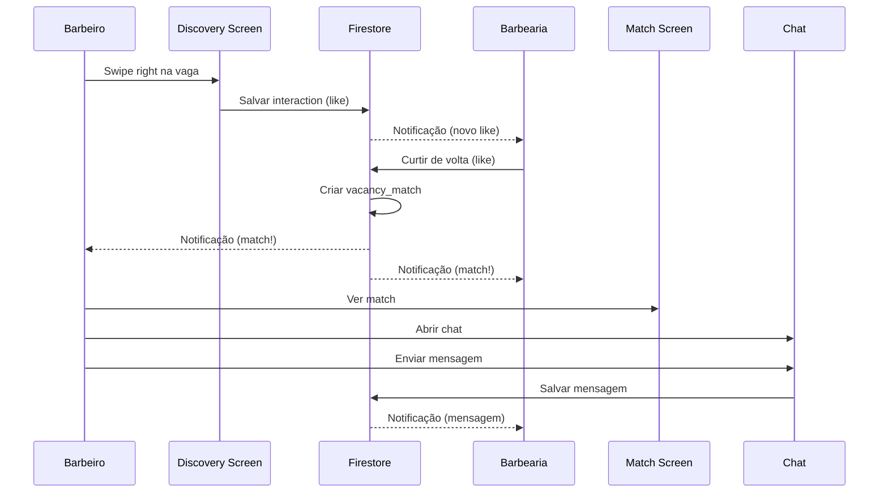

# Plano: Sistema Discovery de Vagas (Estilo Tinder)

## Problema Atual

❌ Tela de detalhes da vaga fica em loading infinito
❌ Está esperando `applications` que não existem
❌ **Falta implementar o fluxo Discovery → Swipe → Match → Chat**

## Arquitetura Correta (Baseada em Tinder/Apps de Relacionamento)

### 1. BARBEIRO vê vagas (Discovery Screen)
```
┌─────────────────────────────────┐
│    DISCOVERY DE VAGAS           │
│                                 │
│   ┌─────────────────────────┐   │
│   │  Barbeiro Sênior        │   │
│   │  NOBRUS BARBERSHOP      │   │
│   │  R$ 3.000/mês + 40%     │   │
│   │  📍 São Paulo, SP       │   │
│   └─────────────────────────┘   │
│                                 │
│   ←  ❌  NOPE    💚 LIKE  →    │
└─────────────────────────────────┘
```

**Ação:** Barbeiro swipa right (like) na vaga

**Firestore:**
```
profiles/{barberId}/interactions/{vacancyId}
{
  "vacancyId": "vacancy_123",
  "type": "like",
  "timestamp": [TIMESTAMP]
}
```

### 2. BARBEARIA recebe notificação
```
┌─────────────────────────────────┐
│   CANDIDATOS INTERESSADOS       │
│                                 │
│   👤 João Silva curtiu sua vaga │
│   "Barbeiro Sênior"             │
│                                 │
│   [VER PERFIL]  [CURTIR] [X]    │
└─────────────────────────────────┘
```

**Ação:** Barbearia pode:
- ❌ Rejeitar (pass)
- ✅ Curtir de volta (like) → **CRIA MATCH!**

### 3. MATCH acontece
```
┌─────────────────────────────────┐
│         🎉 É UM MATCH!          │
│                                 │
│   Você e João Silva deram       │
│   match para Barbeiro Sênior    │
│                                 │
│   [ENVIAR MENSAGEM]             │
└─────────────────────────────────┘
```

**Firestore:**
```
matches/{matchId}
{
  "barberId": "barber_123",
  "barbershopId": "shop_456",
  "vacancyId": "vacancy_789",
  "createdAt": [TIMESTAMP],
  "status": "active"
}
```

### 4. CHAT abre (só após match)
```
┌─────────────────────────────────┐
│   💬 João Silva                  │
│   Vaga: Barbeiro Sênior         │
│                                 │
│   Olá! Tenho 5 anos de...      │
│   experiência com...            │
│                                 │
│   [Digite sua mensagem...]      │
└─────────────────────────────────┘
```

## Estrutura do Firestore

### Collections Necessárias

#### 1. `interactions` (subcollection de profiles)
```
profiles/{userId}/interactions/{vacancyId}
{
  "vacancyId": string,
  "type": "like" | "pass" | "superlike",
  "timestamp": Timestamp,
  "userId": string (redundante mas útil)
}
```

#### 2. `vacancy_matches`
```
vacancy_matches/{matchId}
{
  "barberId": string,
  "barbershopId": string,
  "vacancyId": string,
  "barberName": string,
  "barbershopName": string,
  "vacancyTitle": string,
  "status": "pending" | "active" | "rejected" | "hired",
  "createdAt": Timestamp,
  "lastMessageAt": Timestamp?,
  "unreadCount": {
    "barberId": number,
    "barbershopId": number
  }
}
```

#### 3. `chat_messages` (subcollection de vacancy_matches)
```
vacancy_matches/{matchId}/messages/{messageId}
{
  "senderId": string,
  "senderName": string,
  "text": string,
  "timestamp": Timestamp,
  "read": boolean
}
```

## Implementação - Passo a Passo

### Fase 1: Discovery Screen para Barbeiros ✅ (JÁ EXISTE - ADAPTAR)

**Arquivos:**
- `lib/src/features/discovery/screens/vacancy_discovery_screen.dart` (CRIAR)
- `lib/src/features/discovery/controllers/vacancy_swipe_controller.dart` (CRIAR)
- `lib/src/features/discovery/widgets/vacancy_card.dart` (CRIAR)

**Provider:**
```dart
@riverpod
Stream<List<VacancyEntity>> discoveryVacanciesStream(Ref ref) {
  final currentUser = ref.read(authRepositoryProvider).currentUser;
  final userId = currentUser?.uid;
  
  if (userId == null) return Stream.value([]);
  
  // 1. Buscar todas as vagas ativas
  final vacanciesStream = ref.watch(vacancyRepositoryProvider)
    .watchActiveVacancies();
  
  // 2. Buscar IDs já interagidas
  final interactedIdsStream = ref.watch(interactionRepositoryProvider)
    .watchInteractedVacancyIds(userId);
  
  // 3. Filtrar vagas não vistas
  return CombineLatestStream.combine2(
    vacanciesStream,
    interactedIdsStream,
    (List<VacancyEntity> vacancies, Set<String> interactedIds) {
      return vacancies.where((v) => !interactedIds.contains(v.vacancyId)).toList();
    }
  );
}
```

### Fase 2: Tela "Quem Curtiu Minhas Vagas" (Barbearia)

**Arquivo:** `lib/src/features/management/screens/vacancy_likes_screen.dart`

**Provider:**
```dart
@riverpod
Stream<List<LikeNotification>> vacancyLikesStream(Ref ref, String vacancyId) {
  // Buscar todos os barbeiros que curtiram esta vaga
  // interactions onde type=like e vacancyId=X
}
```

**UI:**
- Lista de barbeiros que curtiram
- Para cada um: foto, nome, preview do perfil
- Botões: ❌ Rejeitar | ✅ Curtir de volta

### Fase 3: Sistema de Match

**Arquivo:** `lib/src/data/repositories/vacancy_match_repository.dart`

**Funções:**
```dart
class VacancyMatchRepository {
  // Criar match quando barbearia curte de volta
  Future<String> createMatch({
    required String barberId,
    required String barbershopId,
    required String vacancyId,
  });
  
  // Verificar se já existe match
  Future<VacancyMatch?> getMatch(String barberId, String vacancyId);
  
  // Listar matches do barbeiro
  Stream<List<VacancyMatch>> watchBarberMatches(String barberId);
  
  // Listar matches da barbearia (por vaga)
  Stream<List<VacancyMatch>> watchVacancyMatches(String vacancyId);
}
```

### Fase 4: Chat (só após match)

**Reusar sistema existente** de chat, mas adaptar para vacancy_matches:

**Arquivo:** `lib/src/features/chat/screens/vacancy_chat_screen.dart`

### Fase 5: Tela de Detalhes da Vaga (CORRIGIR ATUAL)

**Problema:** Está buscando `applications` diretamente
**Solução:** Buscar `vacancy_matches` onde status="active"

```dart
@riverpod
Stream<List<VacancyMatch>> activeMatchesForVacancy(Ref ref, String vacancyId) {
  return ref.watch(vacancyMatchRepositoryProvider)
    .watchVacancyMatches(vacancyId)
    .map((matches) => matches.where((m) => m.status == 'active').toList());
}
```

## Índices Firestore Necessários

```
Collection: profiles/{userId}/interactions
Fields:
  - type (Ascending)
  - timestamp (Descending)

Collection: vacancy_matches
Fields:
  - barberId (Ascending)
  - createdAt (Descending)
  
Collection: vacancy_matches
Fields:
  - vacancyId (Ascending)
  - createdAt (Descending)
  
Collection: vacancy_matches
Fields:
  - barbershopId (Ascending)
  - status (Ascending)
  - createdAt (Descending)
```

## Fluxo Completo



## Próximos Passos IMEDIATOS

### 1. CORRIGIR tela de detalhes (URGENTE)
- Mudar de `applicationsForVacancyStream` para `activeMatchesForVacancy`
- Criar `VacancyMatchRepository` básico
- Adaptar UI para mostrar matches ao invés de applications

### 2. CRIAR Discovery de Vagas
- Copiar/adaptar `DiscoveryScreen` existente
- Criar `VacancyCard` com swipe
- Implementar salvamento de interações

### 3. CRIAR Tela "Quem Curtiu"
- Mostrar barbeiros que curtiram cada vaga
- Botões de curtir/rejeitar
- Criar match ao curtir de volta

### 4. Sistema de Match e Chat
- Adaptar sistema existente de matches
- Reusar chat para vacancy_matches

## Referências no Código

**JÁ IMPLEMENTADO (para perfis):**
- ✅ `TinderCard` widget com swipe
- ✅ `DiscoveryScreen` com stack de cards
- ✅ `InteractionRepository` para likes/passes
- ✅ `MatchRepository` para matches
- ✅ Sistema de chat básico

**PRECISA ADAPTAR:**
- 🔄 Discovery para VAGAS (não perfis)
- 🔄 Match para VAGAS (vacancy_matches)
- 🔄 Tela de detalhes da vaga
- 🔄 Notificações de likes em vagas

**NOVO:**
- ⚠️ VacancyMatchRepository
- ⚠️ Tela "Quem curtiu minhas vagas"
- ⚠️ Lógica de match bidirecional (barber → vaga, shop → barber)
